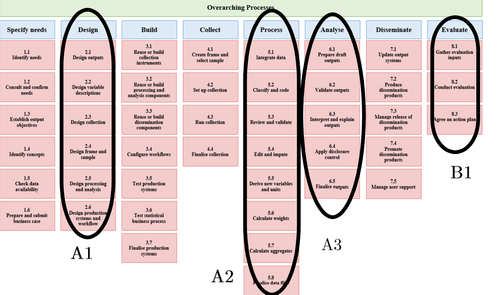
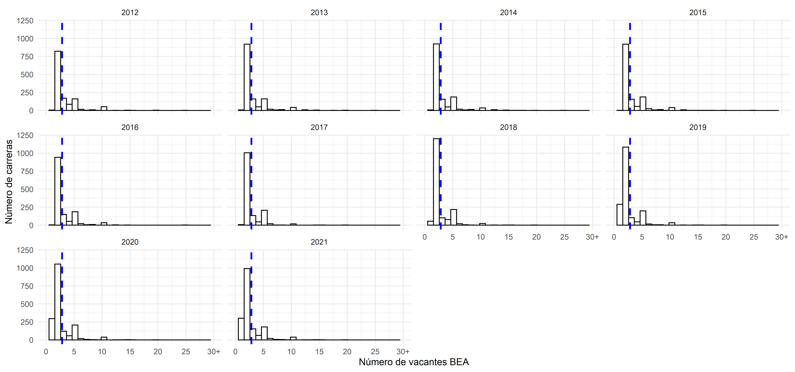
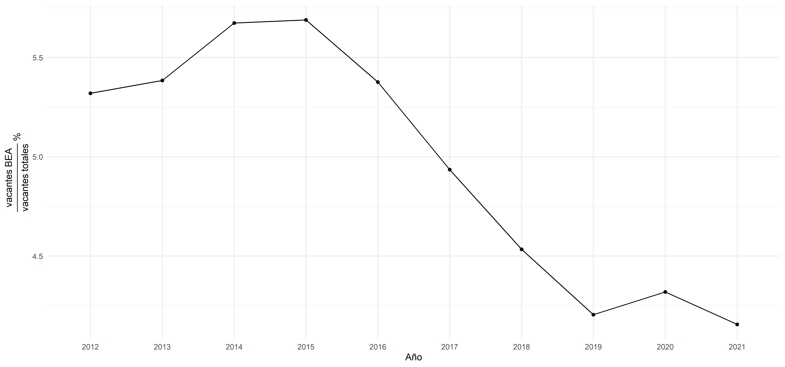

background-image: url("assets/logo/logo.png")
background-size: 15%
background-position: 100% 0%

```{r, load_refs, echo=FALSE, cache=FALSE, message=FALSE, warning=F}
library(readxl)
library(RefManageR)
BibOptions(check.entries = FALSE, 
           bib.style = "authoryear", 
           cite.style = 'authoryear', 
           style = "markdown",
           hyperlink = FALSE, 
           dashed = FALSE)
myBib <- ReadBib("assets/example.bib", check = FALSE)
top_icon = function(x) {
  icons::icon_style(
    icons::fontawesome(x),
    position = "fixed", top = 10, right = 10
  )
}

knitr::opts_chunk$set(comment=NA, prompt=FALSE, cache=FALSE, echo=TRUE, results='asis', message = F, warning = F)
#Kable opts
kable <- function(data) {
  knitr::kable(data, booktabs = TRUE, digits = 2) %>% 
    kable_styling(bootstrap_options = c("striped", "hover", "condensed", "responsive"), latex_options =c("striped", "scale_down"),  full_width = T)
}
options(knitr.kable.NA = ' ', kableExtra.auto_format = FALSE)
pacman::p_load(tidyverse, rvest, kableExtra)

#devtools::install_github(repo="haozhu233/kableExtra", ref="a6af5c0") #para collapse rows
```

```{r load, echo = FALSE}
load("~/GitHub/ra/aapolicies_xaringan/presentations/output/offer.RData")
```

## Overview 

--

1. Project structure

  - GSBPM

--

2. Progress

  - Organice and clean data
  - Information about **Affirmative Actions** in Chile
  - Literature review
  
--

3. *TO-DO* next week

---
class: middle center 

## **1. Project structure**

---
class: middle center 

## Output products

A. Evaluation of higher education AAs in Chile

--

B. Policy Design proposal based on the research results

--
<br><br><br><br><br><br><br>

- *How can we achieve these academic and policy products?*

---

# Proposal

<br>

**GSBPM** – [Generic Statistical Process Model](https://statswiki.unece.org/display/GSBPM/GSBPM+v5.1)


- Provides a framework for organice the statistical process (8 elements)
  
  - The first three phases (Specify Needs, **Design**, and Build) constitute, **Planning**.
  - The next five (Collect, **Process, Analyse**, Disseminate and Archive) correspond to **Production**.
  - With the inclusion of Phase 9 (**Evaluation**)


--

- ***"Reduced form" GSBPM***

1. Design phase [`r icons::icon_style(icons::fontawesome("github"))` issue #7](https://github.com/hbaraho/cuposBEA/issues/7)

2. Process phase [`r icons::icon_style(icons::fontawesome("github"))` issue #8](https://github.com/hbaraho/cuposBEA/issues/8)

3. Analysis phase 

4. Evaluation phase


---

---

## A1. Design phase `r top_icon("github")`

[`r icons::icon_style(icons::fontawesome("github"))` Issue #7](https://github.com/hbaraho/cuposBEA/issues/7)

.content-box-red[Define the statistical outputs, concepts, methodologies and operational processes.]

<br>
<center>


<center>

---

## A2. Process phase `r top_icon("github")`

[`r icons::icon_style(icons::fontawesome("github"))` Issue #8](https://github.com/hbaraho/cuposBEA/issues/8)

.content-box-red[Processing of input data and their preparation for analysis. 
]

<br>
<center>


<center>

---
class: middle center 

## **2. Progress 🚀**

---

## A1. Design phase

**1.1 Design outputs** (see [*"Políticas de Inclusión en ESUP en Chile"* proposal](https://www.dropbox.com/s/722fazlxm738rxs/propuesta_SUA.pdf?dl=0))

--

**1.2 Design variable descriptions and data sources**

```{r, echo = F}
data <- read_excel("input/data/data-structure.xlsx")

data %>% select(-c(7,8)) %>% 
  kableExtra::kable(caption = "Table 1. Data structure and indicators") %>%
  kableExtra::kable_styling(font_size = 11.2) %>% 
  collapse_rows(., columns = 1:5)
```

- [`r icons::icon_style(icons::fontawesome("github"))` GPA Issue #3](https://github.com/hbaraho/cuposBEA/issues/3)

---
## A1. Design phase

**1.3 Design collection**

```{r, echo = F}
data <- read_excel("input/data/data-structure.xlsx", sheet = 2)

data %>% select(-c(7,8)) %>% 
  kableExtra::kable(caption = "Table 2. Actual data") %>%
  kableExtra::kable_styling(font_size = 11) %>% 
  collapse_rows(., columns = 1:5) %>% 
  row_spec(which(data$Method == "Scrapping"), bold = T, color = "white", background = "red") %>% 
    row_spec(which(data$Coverage %in% c("2010-2020", "2012-2021")), bold = T, color = "white", background = "lightblue")
```
---
## A2. Process phase

[`r icons::icon_style(icons::fontawesome("github"))` Issue #8](https://github.com/hbaraho/cuposBEA/issues/8)

<br> 
**Integrate data**

*1. Admission offer data:* Explore data and descriptive statistics

--

- Problems with BEA vacancies

--
*2. Admission demand:* function map_df and long data to wide (MRUN- year as observation unit)

---

Figure 1. BEA vacancies distribution by year
---


Figure 2. Ratio BEA vacancies evolution by year


---

##  Information about **Affirmative Actions** in Chile

[`r icons::icon_style(icons::fontawesome("github"))` AA Wiki](https://github.com/hbaraho/cuposBEA/wiki/Acciones-afirmativas-en-ESUP-en-Chile)

<center>Table 4. AA summary <center>

| AA | Implementation year | Admission system                                                                        | Economic support | "Educational" support                  | Eligibility factors |   
|----------|----------------------------|-------------------------------------------------------------------------------------------|------------------|---------------------------------| --------------------------------------------|
| BEA      | 2007                  | Supernumerary quotas       | Yes               | No                              |  Distinguished academic performance (10% of the best high school graduates), being on the waiting list, coming from public and subsidized schools, socioeconomic level (I to IV quintile).
| PACE     | 2014                     | Supernumerary quotas | No               | In high school and college | Ranking score of the adhering establishment (<= 863) and attendance to the preparation programs.  |
|          |                            |                                                                                           |                  |                                 |


.footnote[
**Information request to Subsecretaría de Educación**
]

---
## Literature review

.blockquote[
### `r icons::fontawesome("comment-dots")` Eficency hypothesis

- AA (...) harm target students by placing them in schools for which they are ill-prepared (**mismatch theory**) 

]

.pull-right[

.small[
]
.blockquote[
### `r icons::fontawesome("location-arrow")` Test
- Comparision BEA - PACE

]

]

---
## Literature review

.blockquote[
### `r icons::fontawesome("comment-dots")` Eficency hypothesis

- Access to alternative high private schools: displaced individuals have to access to alternative high quality colleges 

]

.pull-right[

.small[
]
.blockquote[
### `r icons::fontawesome("question")` Questions
- Evolution of private universities in Chile
- Distinction between public and private universities, traditional, CRUCH, G9 **to capture high quality and competitive institutions.** 

]

]
---
class: middle center

## **3. Questions and *TO-DO list***

---
## Questions 

1. About data files

--

2. GPA data

--

3. PACE in SUA

---
class: fdl-black
background-image: url("assets/logo/logo-blanco.png")
background-size: 15%
background-position: 100% 0%

# ¡Gracias!

.pull-right[.pull-down[

<a href="mailto:valentinaandrade@uchile.cl">
.white[`r icons::icon_style(icons::fontawesome("paper-plane"), fill = "white")` valentinaandrade@uchile.cl]
</a>

<a href="https://valentinaandrade.netlify.app/">
.white[`r icons::icon_style(icons::fontawesome("link"), fill = "white")` https://valentinaandrade.netlify.app/]
</a>

<a href="https://github.com/valentinaandrade">
.white[`r icons::icon_style(icons::fontawesome("github"), fill = "white")` @valentinaandrade]
</a>

  <a href="http://github.com/github.com/hbaraho/cuposBEA/">
  .white[`r icons::icon_style(icons::fontawesome("github"), fill = "white")` @cuposBEA]
  </a>

<br><br><br>

]]

.pull-left.white.middle[
**Políticas de Inclusión en Educación Superior en Chile** - BEA y PACE]
