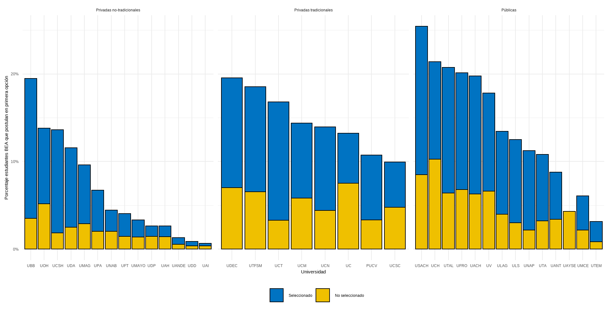

background-image: url("assets/logo/logo.png")
background-size: 15%
background-position: 100% 0%

```{r, load_refs, echo=FALSE, cache=FALSE, message=FALSE, warning=F}
library(readxl)
library(RefManageR)
BibOptions(check.entries = FALSE, 
           bib.style = "authoryear", 
           cite.style = 'authoryear', 
           style = "markdown",
           hyperlink = FALSE, 
           dashed = FALSE)
myBib <- ReadBib("assets/example.bib", check = FALSE)
top_icon = function(x) {
  icons::icon_style(
    icons::fontawesome(x),
    position = "fixed", top = 10, right = 10
  )
}

knitr::opts_chunk$set(comment=NA, prompt=FALSE, cache=FALSE, echo=TRUE, results='asis', message = F, warning = F)
#Kable opts
kable <- function(data) {
  knitr::kable(data, booktabs = TRUE, digits = 2) %>% 
    kable_styling(bootstrap_options = c("striped", "hover", "condensed", "responsive"), latex_options =c("striped", "scale_down"),  full_width = T)
}
options(knitr.kable.NA = ' ', kableExtra.auto_format = FALSE)
pacman::p_load(tidyverse, rvest, kableExtra)

#devtools::install_github(repo="haozhu233/kableExtra", ref="a6af5c0") #para collapse rows
```

```{r load, echo = FALSE}
load("~/GitHub/ra/aapolicies_xaringan/presentations/output/offer.RData")
```

## Overview 

--

1. Progress

  - Especificar requerimiento de datos
  - Análisis descripti

--

2. *TO-DO* next week


---
class: middle center 

## **1. Progress 🚀**

---


---


---

---

---

---

---

---

---

---

---

---
## Literature review

.blockquote[
### `r icons::fontawesome("comment-dots")` Eficency hypothesis

- Access to alternative high private schools: displaced individuals have to access to alternative high quality colleges 

]

.pull-right[

.small[
]
.blockquote[
### `r icons::fontawesome("question")` Questions
- Evolución de universidaes privadas en Chile
- Distinción entre universidades públicas, tradicionales, CRUCH, G9 para capturar calidad y competividad

]

]
---
class: middle center

## **3. Preguntas y *TO-DO list***

---
## Questions 

- Efecto grupo (paper Agarwal and Somaini (2020))

--

- Bias en postulaciones de los BEA y PACE

--

---
class: fdl-black
background-image: url("assets/logo/logo-blanco.png")
background-size: 15%
background-position: 100% 0%

# ¡Gracias!

.pull-right[.pull-down[

<a href="mailto:valentinaandrade@uchile.cl">
.white[`r icons::icon_style(icons::fontawesome("paper-plane"), fill = "white")` valentinaandrade@uchile.cl]
</a>

<a href="https://valentinaandrade.netlify.app/">
.white[`r icons::icon_style(icons::fontawesome("link"), fill = "white")` https://valentinaandrade.netlify.app/]
</a>

<a href="https://github.com/valentinaandrade">
.white[`r icons::icon_style(icons::fontawesome("github"), fill = "white")` @valentinaandrade]
</a>

  <a href="http://github.com/github.com/hbaraho/cuposBEA/">
  .white[`r icons::icon_style(icons::fontawesome("github"), fill = "white")` @cuposBEA]
  </a>

<br><br><br>

]]

.pull-left.white.middle[
**Políticas de Inclusión en Educación Superior en Chile** - BEA y PACE]
